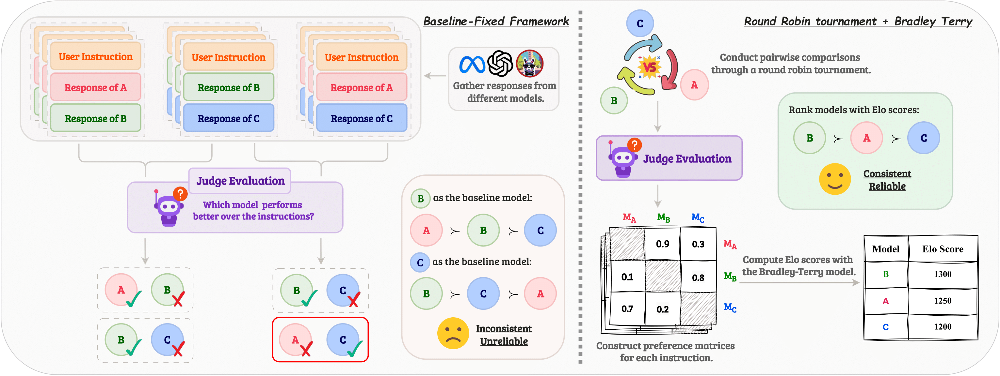

<h2 align="center">
    Investigating Non-Transitivity in LLM-as-a-Judge
 </h2>


<p align="center">
  <a href="https://arxiv.org/abs/2502.14074">
    
  </a>
<a href="https://www.python.org/downloads/release/python-3100/">
  
  <a href="https://opensource.org/licenses/MIT">
    
  </a>
</a>

</p>

<p align="center">
  
</p>

### 💡 Overview
Automatic evaluation methods using large language models (LLMs) are increasingly standard for assessing instruction-following in LLM-based agents. Common pairwise comparison methods rely on the assumption of transitive preferences, which we find is often invalid, causing rankings to vary with the baseline model. We show that round-robin tournaments combined with Bradley-Terry models yield more robust rankings. To reduce computational demands, we introduce Swiss-Wise Iterative Matchmaking (Swim) tournaments, a dynamic matching strategy providing similar reliability more efficiently.


### 📊 Evaluation
We evaluate our proposed method on the [AlpacaEval](https://github.com/tatsu-lab/alpaca_eval) dataset, involving:

- Measuring non-transitivity across different scenarios using GPT-4-Turbo and GPT-3.5-Turbo as judge models.

- Comparing rankings from our methods (round-robin and Swim tournaments) against human evaluations from [Chatbot Arena](https://huggingface.co/spaces/lmarena-ai/chatbot-arena-leaderboard) using Spearman and Kendall correlation coefficients.

- Evaluating effectiveness under conditions of controlled output length to address verbosity bias.

Our results show that the round-robin and Swim-based rankings significantly improve alignment with human judgments compared to baseline-fixed methods, demonstrating robustness and practicality.


### 📑 Citation


```bibtex
@misc{xu2025investigatingnontransitivityllmasajudge,
      title={Investigating Non-Transitivity in LLM-as-a-Judge}, 
      author={Yi Xu and Laura Ruis and Tim Rocktäschel and Robert Kirk},
      year={2025},
      eprint={2502.14074},
      archivePrefix={arXiv},
      primaryClass={cs.AI},
      url={https://arxiv.org/abs/2502.14074}, 
}
```
